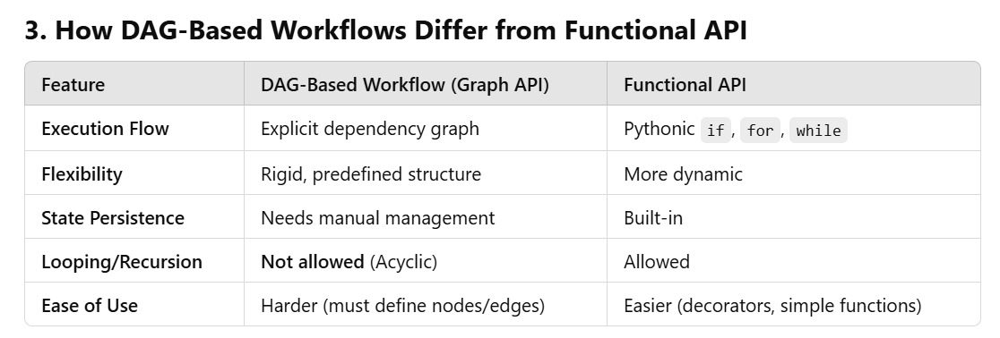

# Step 12A: LangGraph Functional API

Welcome to Step 12 of the Panaverisity Learn Agentic AI series! In this step, you will learn how to use the **LangGraph Functional API** to build Agentic Workflows and AI Agents.

This new API makes it easier to create AI workflows by letting you write your code as simple Python functions. You don't have to design a complex graph structure—just use regular functions with a couple of decorators!

The Functional API helps you take full advantage of LangGraph’s powerful features such as:
- **Human-in-the-Loop:** Pause your workflow to get user feedback.
- **Persistence/Memory:** Save your work so you can continue where you left off.
- **Streaming:** Send real-time updates as your workflow runs.
- **Agentic Infrastructure:** Use LangGraph Server for deployment and production-grade agentic infrastructure, or build your own.

Both the Functional API and the traditional Graph API share the same runtime, which means you can use them together if needed.

See what [companies are building with LangGraph](https://www.langchain.com/built-with-langgraph)

---

## Visual Overview

  
*Why use the Functional API – It is simple, fast, and supports human feedback.*

  
*Compare the Graph API (with nodes and edges) and the simpler Functional API (using regular Python functions).*

  
*Key benefits include easier prototyping, simple debugging, and flexible state management.*

---

## What You Will Learn

You will learn the core concepts of the Functional API, including:

- entrypoint decorator
- tasks decorator

### Advanced Concepts
- **Agentic Design Patterns:**  
  Learn common design patterns for building AI agents.
- **Human-in-the-Loop:**  
  Pause your workflow so someone can review or change the output before continuing.
- **Short-Term Memory:**  
  Keep track of conversation history or workflow state between steps.
- **Long-Term Memory:**  
  Save data for future use so your application can "remember" important details.
- **Streaming:**  
  Show live updates (like progress messages or tokens from a language model) to your users.

---

## Example Workflow: Hello World

In this example, our workflow will:
1. Generate a random city name for a given country.
2. Get a fun fact about that city.
3. Return the city, fun fact, and country as a result.

This code uses two decorators:
- `@task`: Wraps a simple unit of work (such as calling an API).
- `@entrypoint`: Marks the start of a workflow and handles saving state and resuming when needed.

```python
%%capture --no-stderr
%pip install --quiet -U langgraph langchain_openai langchain_google_genai

from langchain_openai import ChatOpenAI
import time
import uuid
from langgraph.func import entrypoint, task
from langgraph.checkpoint.memory import MemorySaver

# Initialize the language model
model = ChatOpenAI(model="gpt-4o-mini")

# Set up an in-memory checkpointer for saving progress
checkpointer = MemorySaver()

@task
def generate_city(country: str) -> str:
    """Ask the model to give a random city name for the given country."""
    print("Starting workflow")
    response = model.invoke(f"Return the name of a random city in the {country}.")
    random_city = response.content
    print(f"Random City: {random_city}")
    return random_city

@task
def generate_fun_fact(city: str) -> str:
    """Ask the model to share a fun fact about the given city."""
    response = model.invoke(f"Tell me a fun fact about {city}")
    fun_fact = response.content
    return fun_fact

@entrypoint(checkpointer=checkpointer)
def main_workflow(country: str) -> dict:
    """The main workflow that gets a city and then a fun fact about it."""
    city = generate_city(country).result()
    fact = generate_fun_fact(city).result()
    return {"city": city, "fun_fact": fact, "country": country}

# Generate a unique thread ID to save workflow state
thread_id = str(uuid.uuid4())
config = {
    "configurable": {
        "thread_id": thread_id
    }
}

# Run the workflow with a sample input (here we use "cat" for fun)
result = main_workflow.invoke("cat", config)
print(f"Generated fun fact: {result}")
```

### Expected Output

When you run the code, you might see something like:

```
Starting workflow
Random City: Sure! How about "Catropolis"? It's a fun, fictional city name inspired by cats!
Generated fun fact: {
    'city': 'Sure! How about "Catropolis"? ...',
    'fun_fact': 'Absolutely! In the whimsical world of "Catropolis," ...',
    'country': 'cat'
}
```

---

## Why This Matters

- **Easy to Learn:**  
  Build workflows using simple Python functions and familiar control structures.
- **Save and Resume:**  
  Your work is saved automatically, so you don't have to repeat tasks if you pause or restart.
- **Human Interaction:**  
  Easily integrate moments for human review or input, ideal for projects like content creation or chatbots.
- **Mix and Match:**  
  Use the Functional API with the Graph API if you need more complex structures—all on the same runtime.

---

## Additional Resources

- **Official Documentation:**  
  [LangGraph Functional API Overview](https://langchain-ai.github.io/langgraph/concepts/functional_api/)
- **Blog Post:**  
  [Introducing the LangGraph Functional API](https://blog.langchain.dev/introducing-the-langgraph-functional-api/)
  [Workflows and Agents¶ Design Patterns](https://langchain-ai.github.io/langgraph/tutorials/workflows)

---

Happy coding and enjoy building your AI workflows with the LangGraph Functional API!

---